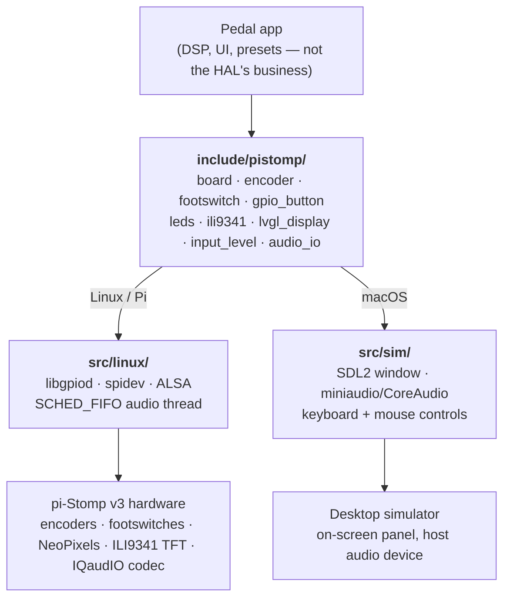

# pistomp-hal

[](https://github.com/TTeuber/pistomp-hal/actions/workflows/ci.yml)
[](https://github.com/TTeuber/pistomp-hal/releases)
[](LICENSE)

A JUCE-free C++17 hardware abstraction layer for the [pi-Stomp](https://www.treefallsound.com/) v3 guitar-pedal platform (Raspberry Pi 5). It packages the reusable hardware drivers behind clean headers so a pedal application links one static library and gets the whole control surface, display, and realtime audio path.

Extracted from a larger pedal project where it drives a live multi-effect worship pedalboard — see [PistompPedalboard](https://github.com/TTeuber/PistompPedalboard) for the HAL in real use.

<!-- TODO(hero images): uncomment once docs/hardware.jpg + docs/simulator.gif exist.
<table>
  <tr>
    <td align="center"><br><em>On the pedalboard</em></td>
    <td align="center"><br><em>Same code, no Pi — the macOS simulator</em></td>
  </tr>
</table>
-->

## Architecture

Headers are the contract; the implementation behind each one is chosen per platform at configure time. An app written against `include/pistomp/` runs unchanged on the pedal and on a desktop.



## What's inside

| Subsystem | Header | Hardware |
|---|---|---|
| Rotary encoders | `pistomp/encoder.h` | Quadrature encoders via libgpiod |
| Footswitches | `pistomp/footswitch.h` | Momentary switches read over SPI |
| GPIO buttons | `pistomp/gpio_button.h` | Push-switches on raw GPIO lines |
| Status LEDs | `pistomp/leds.h` | NeoPixel (timed-serial RGB) state lights |
| Display | `pistomp/ili9341.h` + `pistomp/lvgl_display.h` | ILI9341 SPI TFT driven by LVGL v9 |
| Input metering | `pistomp/input_level.h` | ADC input-level reads |
| Audio | `pistomp/audio_io.h` | Realtime duplex I/O on the codec (ALSA), SCHED_FIFO thread, xrun recovery |
| Board wiring | `pistomp/board.h` / `pistomp/board_v3.h` | Single source of truth for the v3 pin map |

Design rules:

- **No DSP framework.** The HAL is about hardware lines; effects/DSP live in the app. `audio_io.h` is deliberately ALSA-free (pimpl) — the app supplies one callback and never sees ALSA.
- **The board owns the footguns.** Several peripherals share the SPI bus; `Board` owns the shared SPI mutex and vends fully-wired controls (`openLcd`, `openNavEncoder`, `openFootswitch`, …), so a consumer can't forget the lock and corrupt the bus.
- **Headers are the contract.** Each subsystem's `.cpp` is selected per platform in CMake — porting is a file move, not a rewrite.
- **Testable logic is extracted.** The pure decision logic inside the drivers (quadrature decoding, debouncing) lives in header-only units under `pistomp/detail/`, unit-tested on any host — no hardware, no mocks.

## Examples

Four small programs in [`examples/`](examples/), each compiling **unchanged** for both backends — the same source drives the real hardware on the Pi and the simulator on the Mac (see [`examples/README.md`](examples/README.md) for details and per-example caveats):

| Example | Shows |
|---|---|
| [`passthrough`](examples/passthrough/) | The audio contract: open the codec, copy in→out in the realtime callback |
| [`controls`](examples/controls/) | `Board` vending the control surface: encoder turns cycle an LED hue, footswitches toggle their LEDs (hardware-first — the sim's input rides the SDL window) |
| [`display`](examples/display/) | LVGL v9 on the ILI9341 (an SDL window on the Mac) |
| [`mini_pedal`](examples/mini_pedal/) | A complete tiny pedal: encoder gain, footswitch bypass with LED feedback, live level on screen — atomics between the realtime and UI threads |

```
cmake -G Ninja -B build -DCMAKE_POLICY_VERSION_MINIMUM=3.5 -DPISTOMP_HAL_BUILD_EXAMPLES=ON
cmake --build build
./build/examples/mini_pedal/mini_pedal
```

## Platforms

- **Linux / Raspberry Pi** — the real drivers: libgpiod v1, spidev, ALSA.
- **macOS simulator** — the same headers backed by a desktop simulator: the LVGL UI in an SDL2 window, audio through miniaudio/CoreAudio, controls fed from the keyboard and mouse. Lets an entire pedal app run and be developed with no Pi attached.

Simulator controls (mouse works too — drag an on-screen encoder vertically to turn it, click its centre to push it, click a footswitch to stomp it):

| Control | Keys |
|---|---|
| Nav encoder turn / select | `←` `→` / `Return` (hold `Return` to quit) |
| Encoder 1 turn / push | `Q` `W` / `E` |
| Encoder 2 turn / push | `A` `S` / `D` |
| Encoder 3 (master) turn | `Z` `X` |
| Footswitches 1–4 | `1` `2` `3` `4` |

## Using it

Consume via CMake FetchContent, pinned to a tag:

```cmake
include(FetchContent)
FetchContent_Declare(pistomp_hal
  GIT_REPOSITORY https://github.com/TTeuber/pistomp-hal.git
  GIT_TAG v0.2.0)
FetchContent_MakeAvailable(pistomp_hal)

target_link_libraries(my_pedal PRIVATE pistomp_hal)
```

Linking `pistomp_hal` PUBLICly propagates LVGL, the driver headers, and (on Linux) libgpiod — no extra wiring in the consumer.

To hack on the HAL and an app together, point the fetch at a local checkout:

```
cmake -B build -DFETCHCONTENT_SOURCE_DIR_PISTOMP_HAL=/path/to/pistomp-hal
```

### Sketch

```cpp
#include "pistomp/board.h"
#include "pistomp/audio_io.h"

pistomp::Board board;

Encoder nav;
board.openNavEncoder(nav, "my-app");

pistomp::AudioIO audio;
audio.open();   // negotiate the codec; audio.period() now holds the block size
audio.start([](const float* const* in, float* const* out, int frames) {
    // guitar arrives on in[0]; write out[0]/out[1]. Realtime thread — no locks,
    // no allocation.
    for (int ch = 0; ch < 2; ++ch)
        for (int i = 0; i < frames; ++i)
            out[ch][i] = in[0][i];
});
```

The [examples](examples/) are the fuller version of this sketch.

## Building standalone

```
# macOS (simulator backend):  brew install cmake ninja sdl2
# Linux (Pi backend):         apt install cmake ninja-build pkg-config libgpiod-dev libasound2-dev
cmake -G Ninja -B build -DCMAKE_POLICY_VERSION_MINIMUM=3.5
cmake --build build
```

Optional switches: `-DPISTOMP_HAL_BUILD_EXAMPLES=ON` and `-DPISTOMP_HAL_BUILD_TESTS=ON`.

`CMAKE_POLICY_VERSION_MINIMUM=3.5` lets the fetched LVGL configure under CMake 4.x.

Pi binaries are best built in a `debian:bookworm` arm64 container so they link against the same glibc the Pi runs — on Apple Silicon that container runs natively, no cross-compiler needed. [CI](.github/workflows/ci.yml) builds exactly that pairing on every push: the simulator backend on a macOS runner and the Pi backend in a bookworm arm64 container.

## Tests

The drivers' decision logic — the quadrature state machine, ADC thresholding, debounce/edge detection — is extracted into header-only units in [`include/pistomp/detail/`](include/pistomp/detail/) and tested with Catch2 on any host, no hardware or mocks:

```
cmake -G Ninja -B build -DCMAKE_POLICY_VERSION_MINIMUM=3.5 -DPISTOMP_HAL_BUILD_TESTS=ON
cmake --build build
ctest --test-dir build --output-on-failure
```

## License

MIT — see [LICENSE](LICENSE).
